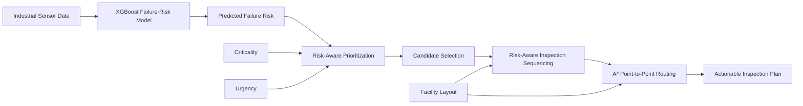
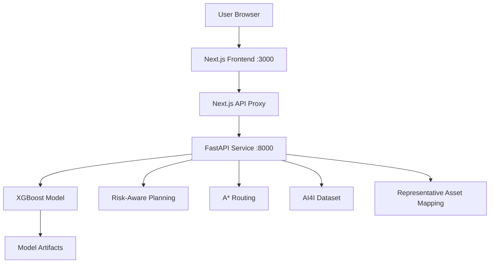

# MaintenRoute AI

**Risk-Aware Predictive Maintenance Planning for Industrial Facilities**

MaintenRoute AI is an end-to-end predictive maintenance prototype that turns industrial sensor data into an actionable technician inspection plan.

Instead of stopping at a failure-risk score, the system coordinates:

**sensor analysis → failure-risk prediction → maintenance prioritization → inspection sequencing → route planning**

The prototype was developed for the **ABB Accelerator 2026 — Agentic Predictive Maintenance Studio** challenge.

---

## 1. Why MaintenRoute AI?

Predictive maintenance systems often answer only one question:

> *Which machine is likely to fail?*

In practice, a maintenance team also needs to know:

- Which assets should be inspected first?
- Which high-risk assets fit within today's inspection capacity?
- How should operational criticality and urgency affect priority?
- What route should the technician follow through the facility?
- How should the plan change when sensor conditions or the facility layout changes?

MaintenRoute AI connects these decisions into one workflow.

---

## 2. System Overview



The system coordinates failure-risk estimation, maintenance prioritization, and route planning with minimal manual intervention while keeping the operator in control of planning parameters and facility edits.

> **Important:** A* is used to compute the shortest point-to-point path between already selected inspection stops. Asset selection and multi-stop ordering are handled separately by the planning logic. MaintenRoute AI does **not** claim globally optimal multi-stop routing.

---

## 3. Core Features

### Predictive Maintenance ML

- Uses the **AI4I 2020 Predictive Maintenance Dataset**
- Binary target: `Machine failure`
- Final model: **XGBoost**
- Handles the dataset's strong class imbalance with class weighting
- Uses a validation-selected operating threshold
- Returns:
  - Predicted Failure Risk
  - Risk Level
  - Failure Alert

### Risk-Aware Prioritization

Each asset receives a planning priority based on:

```text
Priority =
    Risk Weight × Predicted Failure Risk
  + Criticality Weight × Criticality
  + Urgency Weight × Urgency
```

Default weights:

| Signal | Weight |
|---|---:|
| Predicted Failure Risk | 0.60 |
| Criticality | 0.25 |
| Urgency | 0.15 |

In this prototype, **Predicted Failure Risk** is model-derived. **Criticality** and **Urgency** are configurable simulated operational signals used to demonstrate integration with information that would typically come from asset-management, production, or CMMS systems.

### Capacity-Aware Candidate Selection

The planning engine can control:

- Minimum Failure Risk
- Inspection Capacity
- Distance Weight
- Number of Active Assets

Assets below the planning threshold are excluded before inspection sequencing.

### Risk-Aware Inspection Sequencing

Selected maintenance candidates are sequenced using a lightweight greedy planning strategy that balances maintenance priority against travel distance.

This produces an operationally useful route without claiming a globally optimal Traveling Salesperson solution.

### A* Facility Routing

For each consecutive inspection stop, A* computes a shortest traversable path through the facility grid while respecting obstacles.

### Editable Facility Layout

The Planning page supports direct map editing at all times.

Operators can:

- Move an asset
- Move the technician starting position
- Toggle obstacles
- Restore the current source layout

Both **Default** and **Auto-generated** layouts remain editable after loading.

### Auto-Generated Facility Layouts

The prototype can generate simulated facility layouts using configurable:

- Factory width
- Factory height
- Obstacle density
- Random seed

Generated layouts are checked so the active assets remain reachable from the technician start.

### Sensor Scenario Testing

The Assets page supports end-to-end scenario analysis.

A user can modify an asset's sensor readings and apply the scenario to the full pipeline:

```text
Sensor change
    ↓
XGBoost inference
    ↓
Updated failure risk
    ↓
Updated priority
    ↓
Updated inspection candidates / sequence
    ↓
Updated A* route
```

This makes it possible to demonstrate how a changing equipment condition can affect the maintenance plan.

### Model Operations View

The application exposes model and service information through the UI and FastAPI endpoints, including:

- Service health
- Selected model
- Operating threshold
- Held-out model metrics

Model-selection experiments were also tracked with **MLflow** during development.

---

## 4. Dataset and Features

MaintenRoute AI uses the **AI4I 2020 Predictive Maintenance Dataset**.

Dataset size:

```text
10,000 observations
```

Model inputs:

| Feature | Description |
|---|---|
| `Type` | Product quality type |
| `Air temperature [K]` | Ambient air temperature |
| `Process temperature [K]` | Process temperature |
| `Rotational speed [rpm]` | Machine rotational speed |
| `Torque [Nm]` | Applied torque |
| `Tool wear [min]` | Tool wear duration |

Target:

```text
Machine failure
```

The failure-specific columns `TWF`, `HDF`, `PWF`, `OSF`, and `RNF` are excluded from model inputs to avoid target leakage. Identifier fields are also excluded.

The dataset is highly imbalanced, with an overall machine-failure rate of approximately **3.39%**.

---

## 5. Model Development

### Data Split

A stratified split is used to preserve the failure ratio:

```text
Full dataset:        10,000
Outer training pool:  8,000
Held-out test set:    2,000

Inner training set:   6,400
Validation set:       1,600
```

The validation set is used for model comparison and operating-threshold selection. The held-out test set is reserved for final evaluation.

### Candidate Models

Two candidate models were evaluated:

- Random Forest
- XGBoost

Model selection is based primarily on validation **Average Precision**, which is useful for the imbalanced failure-detection setting.

### Final Model

The selected model is **XGBoost**.

Key configuration:

```text
n_estimators       = 400
max_depth          = 4
learning_rate      = 0.05
subsample          = 0.80
colsample_bytree   = 0.80
min_child_weight   = 1
reg_lambda         = 1
tree_method        = hist
```

Class imbalance is addressed with:

```text
scale_pos_weight ≈ 28.49
```

The selected operating threshold is:

```text
0.81
```

### Held-Out Test Performance

| Model | Precision | Recall | F1 | ROC-AUC | Average Precision |
|---|---:|---:|---:|---:|---:|
| Random Forest | 0.6667 | 0.5294 | 0.5902 | 0.9597 | 0.7134 |
| **XGBoost** | **0.7931** | **0.6765** | **0.7302** | **0.9712** | **0.7953** |

XGBoost was selected because it achieved stronger validation and held-out performance for the prototype.

> The UI intentionally uses the term **Predicted Failure Risk**, not calibrated real-world failure probability. The model uses class weighting and has not undergone probability calibration for deployment in a real industrial environment.

---

## 6. Risk Levels vs. Failure Alert

Risk visualization and the binary operating decision are intentionally separate.

Risk bands:

| Risk | Level |
|---|---|
| `>= 0.80` | CRITICAL |
| `>= 0.60` | HIGH |
| `>= 0.40` | MEDIUM |
| `< 0.40` | LOW |

Failure Alert:

```text
ALERT  if Predicted Failure Risk >= 0.81
NORMAL otherwise
```

For example, a machine with a predicted risk of `80.8%` can appear as **CRITICAL** while still showing **NORMAL**, because `0.808 < 0.81`.

---

## 7. Planning Logic

### Step 1 — Predict Failure Risk

The XGBoost model produces a risk score for each active asset.

### Step 2 — Calculate Operational Priority

Predicted risk is combined with configurable criticality and urgency signals.

### Step 3 — Filter Candidates

Assets below `Minimum Failure Risk` are removed from the inspection candidate set.

### Step 4 — Apply Inspection Capacity

Only the highest-priority candidates that fit within the configured inspection capacity are retained.

### Step 5 — Sequence Inspections

The planner uses a risk-aware greedy utility that considers both asset priority and route distance.

Conceptually:

```text
Utility =
    Priority Score
    - Distance Weight × Normalized Travel Distance
```

### Step 6 — Compute Facility Paths

A* computes each point-to-point path between the technician start and consecutive selected inspection stops.

---

## 8. Prototype Planning Results

On the default simulated facility layout, one representative baseline produced:

```text
MaintenRoute route distance: 29 grid steps
Risk-only route distance:    37 grid steps
Travel reduction:            21.6%
High-risk coverage:          100%
```

These values demonstrate the behavior of the planning method **within the simulated prototype layout**. They are not claimed as measured savings from a real industrial facility.

Because the facility layout, risk scenario, planning threshold, inspection capacity, and distance weight are configurable, the displayed route metrics can change during the demo.

---

## 9. Application Architecture



### Frontend

- Next.js
- React
- TypeScript
- Recharts

### Backend

- FastAPI
- Python
- pandas
- NumPy
- joblib
- XGBoost model artifact

### MLOps / Experiment Tracking

- MLflow
- Local model-selection experiment tracking
- Frozen deployment model artifact and metadata

---

## 10. User Interface

The application contains four main views.

### Overview

Operational summary of:

- Active assets
- Critical assets
- Planned inspections
- Travel reduction
- Fleet risk
- Inspection queue
- Technician route

### Assets

Inspect an individual machine and run a sensor scenario.

Changing sensor values and selecting **Apply Scenario** sends the new observation through prediction and planning, allowing the user to see downstream changes.

### Planning

Interactive facility and route-planning workspace.

Controls include:

- Minimum Failure Risk
- Inspection Capacity
- Distance Weight
- Default / Auto layout source

The map itself is always editable through:

- Move Asset
- Technician
- Toggle Obstacle
- Restore Source

### Model Ops

Displays service and deployed-model information.

---

## 11. API

FastAPI provides the following endpoints:

| Method | Endpoint | Purpose |
|---|---|---|
| `GET` | `/` | Service summary |
| `GET` | `/health` | Backend/model health |
| `GET` | `/model-info` | Model metadata and metrics |
| `POST` | `/predict` | Single sensor-observation inference |
| `GET` | `/assets` | Representative asset state |
| `POST` | `/planning` | End-to-end maintenance planning |

Interactive API documentation is available from FastAPI at:

```text
http://localhost:8000/docs
```

when the API port is exposed locally.

---

## 12. Project Structure

A typical project layout is:

```text
MaintenRouteAI/
├── api.py
├── docker-compose.yml
├── Dockerfile.api
├── requirements.txt
│
├── models/
│   ├── best_model.joblib
│   └── model_selection_metadata.json
│
├── data/
│   ├── raw/
│   │   └── ai4i2020.csv
│   └── processed/
│       ├── asset_failure_risks.csv
│       └── mlflow_run_summary.csv
│
├── notebooks/
│   └── ... model development / MLflow notebooks
│
└── frontend/
    ├── app/
    ├── components/
    ├── lib/
    ├── Dockerfile
    ├── package.json
    └── ...
```

The backend expects these files to exist:

```text
models/best_model.joblib
models/model_selection_metadata.json
data/raw/ai4i2020.csv
data/processed/asset_failure_risks.csv
```

---

## 13. Run with Docker

### Prerequisites

- Docker Desktop
- Docker Compose

From the project root:

```powershell
docker compose up --build
```

Then open:

```text
http://localhost:3000
```

To stop the application:

```powershell
docker compose down
```

The Docker deployment uses:

```text
Browser
   ↓
Next.js :3000
   ↓
Next.js server-side API proxy
   ↓
FastAPI :8000
   ↓
Model + planning engine
```

The frontend container communicates with FastAPI over the Docker network using:

```text
FASTAPI_URL=http://api:8000
```

---

## 14. Run Locally Without Docker

### Backend

From the project root:

```powershell
python -m uvicorn api:app --reload --host 127.0.0.1 --port 8000
```

### Frontend

In another terminal:

```powershell
cd frontend
npm install
npm run dev
```

Then open:

```text
http://localhost:3000
```

The frontend API proxy defaults to:

```text
http://127.0.0.1:8000
```

when `FASTAPI_URL` is not explicitly configured.

---

## 15. Suggested Demo Flow

A concise end-to-end demo can follow this sequence:

1. Open **Overview** and introduce the fleet-level maintenance status.
2. Open **Planning** and show the current inspection queue and technician route.
3. Open **Assets** and select a representative asset such as `M05`.
4. Change its sensor values within the observed AI4I ranges.
5. Click **Apply Scenario**.
6. Show the updated Predicted Failure Risk and priority.
7. Return to **Planning** and show how the inspection queue or route changes.
8. Select **Auto** and generate a new simulated facility layout.
9. Move an asset, technician, or obstacle directly on the map.
10. Show the route recomputing on the edited facility.

This demonstrates that MaintenRoute AI is not only a predictive model; it connects prediction to an actionable maintenance workflow.

---

## 16. Design Decisions

### Why XGBoost?

XGBoost provided the strongest validation and held-out performance among the evaluated candidate models while remaining lightweight enough for fast interactive inference.

### Why Average Precision?

Machine failures are rare in AI4I. Average Precision focuses evaluation on the positive failure class and is more informative than accuracy alone for this imbalanced setting.

### Why Separate the Alert Threshold and Planning Threshold?

They answer different operational questions:

- **Alert threshold (`0.81`)**: model operating decision
- **Planning threshold (default `0.40`)**: which machines are eligible for inspection planning

A machine can therefore be worth planning for before it crosses the binary failure-alert threshold.

### Why A*?

A* provides transparent and efficient point-to-point routing through a grid with obstacles. It is easy to visualize and recompute when the facility layout changes.

### Why Not Claim Global Route Optimality?

MaintenRoute uses separate candidate selection, greedy sequencing, and point-to-point A*. This is intentionally lightweight and interpretable for the prototype. It is not an exact global multi-stop optimizer.

---

## 17. Limitations

This is a research and hackathon prototype rather than a production predictive-maintenance system.

Current limitations include:

- AI4I is a synthetic benchmark dataset rather than live ABB equipment telemetry.
- Representative facility assets are mapped from held-out observations for visualization.
- Criticality and urgency are simulated operational fields.
- Facility layouts are simulated rather than imported from a real plant.
- Predicted Failure Risk is not probability-calibrated.
- The route planner does not solve globally optimal multi-stop routing.
- No direct CMMS, ERP, historian, or live sensor integration is included.
- Prototype routing metrics should not be interpreted as guaranteed real-world savings.

These boundaries are intentional and make the assumptions of the prototype explicit.

---

## 18. Production Extension Path

A production-oriented version could extend the prototype with:

- Live industrial telemetry ingestion
- CMMS integration for work orders and maintenance history
- ERP / production-system integration for asset criticality
- Plant floor-plan import
- Dynamic technician schedules and skill constraints
- Calibration and drift monitoring
- Automated retraining and approval workflows
- Role-based access and audit logging
- More advanced multi-stop route optimization
- Real maintenance-cost and downtime objectives

---

## 19. MLOps Workflow

During model development, Random Forest and XGBoost candidate experiments were tracked with MLflow.

The selected XGBoost model was then logged as the deployment model together with its operating threshold and held-out metrics.

Development flow:

```text
Dataset
   ↓
Preprocessing
   ↓
Candidate Training
   ↓
Validation Comparison
   ↓
Threshold Selection
   ↓
Held-Out Evaluation
   ↓
MLflow Tracking
   ↓
Frozen Deployment Artifact
   ↓
FastAPI Inference
```

This separates experimentation from the model artifact used by the application.

---

## 20. Project Goal

MaintenRoute AI is designed around a simple idea:

> **Predictive maintenance becomes more useful when a risk score is converted into a concrete maintenance action.**

The prototype demonstrates how machine-learning inference, operational prioritization, and facility-aware routing can be coordinated to help a maintenance team decide **what to inspect, in what order, and how to reach it**.
