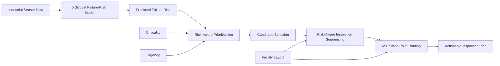
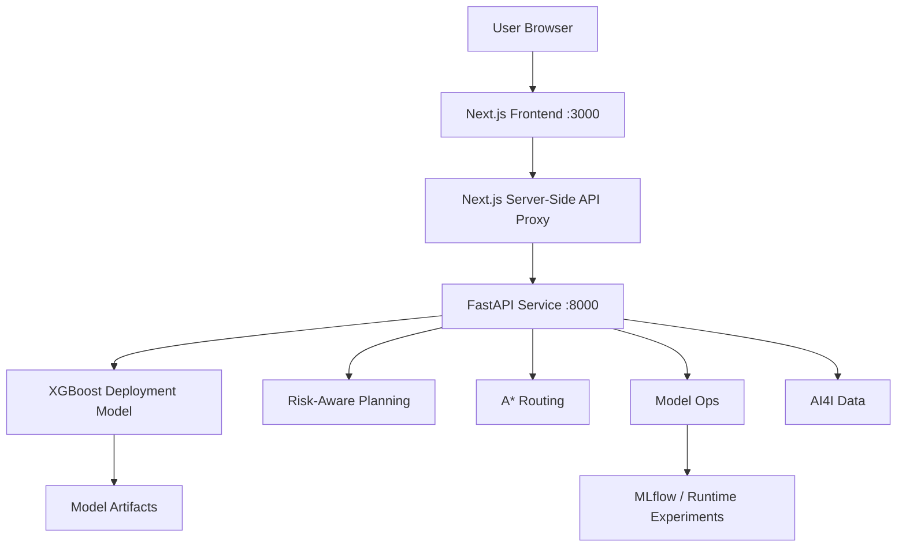

# MaintenRoute AI

**Risk-Aware Predictive Maintenance Planning for Industrial Facilities**

MaintenRoute AI is an end-to-end predictive-maintenance prototype that converts industrial sensor data into an actionable technician inspection plan.

Instead of stopping at a machine-learning risk score, the system connects:

**Sensor Data → Failure-Risk Prediction → Maintenance Prioritization → Inspection Sequencing → Facility Routing**

The prototype was developed for the **ABB Accelerator 2026 — Theme 1: Agentic Predictive Maintenance Studio**.

---

## Quick Start

### Prerequisites

Install:

- Git
- Docker Desktop
- Docker Compose

> **Important:** Docker Desktop must be running before starting the application.

### 1. Clone the repository

```bash
git clone https://github.com/kwyo1201/MaintenRoute-AI.git
cd MaintenRoute-AI
```

### 2. Start the full application

```bash
docker compose up --build
```

The first build may take several minutes because Docker must install the Python and Node.js dependencies.

### 3. Open the application

Dashboard:

```text
http://localhost:3000
```

FastAPI documentation:

```text
http://localhost:8000/docs
```

Backend health endpoint:

```text
http://localhost:8000/health
```

### 4. Stop the application

```bash
docker compose down
```

---

## Why MaintenRoute AI?

Predictive-maintenance systems commonly answer:

> **Which machine may fail?**

A maintenance team still needs to decide:

- Which assets should be inspected first?
- Which high-risk assets fit within the available inspection capacity?
- How should operational criticality and urgency affect priority?
- How should travel distance influence inspection order?
- What path should the technician follow through the facility?
- How should the plan change when machine conditions or the facility layout change?

MaintenRoute AI connects prediction to these operational decisions.

---

## System Overview



MaintenRoute AI coordinates failure-risk estimation, maintenance prioritization, inspection sequencing, and route planning while leaving planning controls and layout editing visible to the operator.

> **Important:** A* is used for shortest point-to-point paths between consecutive inspection stops. Asset selection and multi-stop ordering are handled separately by the planning logic. The prototype does **not** claim globally optimal multi-stop routing.

---

## Core Features

### Predictive Maintenance Model

The deployed classifier is **XGBoost** and uses six leakage-safe AI4I features:

- Product type
- Air temperature
- Process temperature
- Rotational speed
- Torque
- Tool wear

The model output is presented as **Predicted Failure Risk** rather than as a calibrated real-world failure probability.

### Risk-Aware Maintenance Priority

Each asset receives an operational priority score:

```text
Priority =
    Risk Weight × Predicted Failure Risk
  + Criticality Weight × Criticality
  + Urgency Weight × Urgency
```

Default weights:

| Signal | Weight |
|---|---:|
| Predicted Failure Risk | 0.60 |
| Criticality | 0.25 |
| Urgency | 0.15 |

In the prototype:

- **Predicted Failure Risk** is produced by the deployed XGBoost model.
- **Criticality** and **Urgency** are simulated/configurable operational metadata.

In a production system, criticality and urgency could come from CMMS, ERP, production, or asset-management systems.

### Capacity-Aware Candidate Selection

The planner supports configurable:

- Minimum Failure Risk
- Inspection Capacity
- Distance Weight
- Number of Active Assets

Assets below the planning threshold are excluded before sequencing.

### Risk-Aware Inspection Sequencing

MaintenRoute uses a lightweight greedy sequencing heuristic that balances operational priority against obstacle-aware travel distance.

Conceptually:

```text
Utility =
    Priority Score
    - Distance Weight × Normalized Travel Distance
```

This keeps the prototype fast and interpretable without claiming global route optimality.

### A* Facility Routing

A* computes the shortest traversable path between consecutive inspection stops while avoiding simulated facility obstacles.

### Editable Facility Layout

The Planning view supports direct editing of the current facility layout.

Operators can:

- Move an asset
- Move the technician start position
- Toggle obstacles
- Restore the source layout

Both **Default** and **Auto-generated** layouts remain editable after loading.

### Auto-Generated Layouts

The prototype can generate simulated layouts using configurable values such as:

- Factory width
- Factory height
- Obstacle density
- Random seed

Generated layouts are checked so active assets remain reachable from the technician start.

### End-to-End Sensor Scenario

The Assets page supports what-if sensor scenarios:

```text
Sensor Change
    ↓
XGBoost Inference
    ↓
Updated Predicted Failure Risk
    ↓
Updated Priority
    ↓
Updated Candidate Set / Sequence
    ↓
Updated Technician Route
```

This demonstrates how a sensor-level change can propagate into an operational maintenance decision.

### Local Feature Sensitivity

The Assets page also provides **Explain current sensor inputs**.

For one feature at a time, the current value is replaced with a reference value from the dataset and the model is evaluated again.

The resulting difference is a **local sensitivity signal**. It is:

- not SHAP,
- not additive,
- not a causal explanation,
- not a calibrated probability decomposition.

---

## Model Operations / MLOps

MaintenRoute includes a dedicated **Model Ops** workflow.

It supports:

- Backend and model health checks
- AI4I dataset quality and class-balance review
- Historical Random Forest vs XGBoost comparison
- Selected-model metadata and operating threshold
- Held-out evaluation metrics
- Global feature importance for the deployed model
- Uploading an AI4I-schema CSV for a new candidate-model experiment
- Running a new Random Forest vs XGBoost model-selection experiment
- MLflow experiment tracking

### Deployment Safety

The currently serving model is frozen in:

```text
models/best_model.joblib
```

In-app model-selection experiments are intentionally separated from deployment.

A new experiment:

- does **not** replace `best_model.joblib`,
- does **not** change the model serving Assets or Planning,
- does **not** use the frozen held-out test partition for candidate selection,
- is recorded separately in the runtime MLflow store.

This prevents an experiment from silently changing the deployed maintenance-planning system.

### MLflow Artifacts

The repository includes the historical MLflow database and experiment artifacts:

```text
mlflow.db
mlflow_artifacts/
```

New in-app experiment state is persisted through the Docker-mounted:

```text
runtime/
```

---

## Dataset

MaintenRoute AI uses the **AI4I 2020 Predictive Maintenance Dataset**.

Dataset size:

```text
10,000 observations
```

### Model Inputs

| Feature | Description |
|---|---|
| `Type` | Product-quality type |
| `Air temperature [K]` | Ambient air temperature |
| `Process temperature [K]` | Process temperature |
| `Rotational speed [rpm]` | Machine rotational speed |
| `Torque [Nm]` | Applied torque |
| `Tool wear [min]` | Tool-wear duration |

Target:

```text
Machine failure
```

The following failure-mode indicator columns are excluded from model inputs to avoid target leakage:

```text
TWF
HDF
PWF
OSF
RNF
```

Identifier columns are also excluded.

Approximate machine-failure prevalence:

```text
3.39%
```

---

## Model Development

### Data Split

A stratified split is used to preserve the failure ratio:

```text
Full dataset:         10,000
Outer training pool:   8,000
Held-out test set:     2,000

Inner training set:    6,400
Validation set:        1,600
```

The validation set is used for candidate-model comparison and threshold selection.

The held-out test set is reserved for final evaluation.

### Candidate Models

Two main candidate models are evaluated:

- Random Forest
- XGBoost

Model selection is based primarily on validation **Average Precision**.

The internal historical metadata uses the legacy key `pr_auc`, but the value was computed with `average_precision_score`; therefore the user-facing documentation calls this metric **Average Precision**.

### Selected Model

The deployed model is **XGBoost**.

Selected operating threshold:

```text
0.81
```

### Held-Out Test Performance

| Model | Precision | Recall | F1 | ROC-AUC | Average Precision |
|---|---:|---:|---:|---:|---:|
| Random Forest | 0.6667 | 0.5294 | 0.5902 | 0.9597 | 0.7134 |
| **XGBoost** | **0.7931** | **0.6765** | **0.7302** | **0.9712** | **0.7953** |

XGBoost was selected because it produced stronger validation and held-out performance in this prototype.

---

## Risk Levels and Failure Alert

Risk visualization and binary alerting are intentionally separate.

| Predicted Failure Risk | Risk Level |
|---|---|
| `>= 0.80` | CRITICAL |
| `>= 0.60` | HIGH |
| `>= 0.40` | MEDIUM |
| `< 0.40` | LOW |

Binary failure alert:

```text
ALERT  if Predicted Failure Risk >= 0.81
NORMAL otherwise
```

For example, an asset at `80.8%` can be labeled **CRITICAL** while still showing **NORMAL**, because:

```text
0.808 < 0.81
```

The maintenance-planning threshold is a separate operational policy and is not the same as the binary failure-alert threshold.

---

## Planning Pipeline

### Step 1 — Predict Failure Risk

The XGBoost model estimates a risk score for each active asset.

### Step 2 — Compute Operational Priority

Predicted failure risk is combined with simulated criticality and urgency.

### Step 3 — Filter Maintenance Candidates

Assets below `Minimum Failure Risk` are removed.

Default planning threshold:

```text
0.40
```

### Step 4 — Apply Inspection Capacity

Only as many candidates as the configured inspection capacity allows are retained.

### Step 5 — Build the Inspection Sequence

MaintenRoute uses the risk-distance heuristic to order the selected candidates.

### Step 6 — Compute Point-to-Point Paths

A* calculates the shortest traversable path between:

```text
Technician Start
    ↓
Inspection Stop 1
    ↓
Inspection Stop 2
    ↓
...
```

A* does not choose the candidate set and does not solve the complete multi-stop routing problem.

---

## Prototype Planning Result

For the representative default simulated facility layout:

```text
MaintenRoute route distance: 29 grid steps
Risk-only route distance:    37 grid steps
Travel-distance reduction:   21.6%
High-risk coverage:          100%
```

The stored planning comparison also reports a lower risk-weighted arrival cost for MaintenRoute than for the risk-only ordering.

These results are specific to the simulated prototype layout and representative asset scenario. They should **not** be interpreted as guaranteed savings in a real industrial facility.

Displayed planning metrics can change when the user modifies:

- Sensor scenarios
- Facility layout
- Minimum planning risk
- Inspection capacity
- Distance weight

---

## Application Architecture



### Frontend

- Next.js
- React
- TypeScript
- Recharts

### Backend

- FastAPI
- Python
- pandas
- NumPy
- scikit-learn
- XGBoost
- joblib

### MLOps

- MLflow
- Candidate-model tracking
- Threshold tracking
- Evaluation artifacts
- Frozen deployment model
- Separate runtime experiments

---

## User Interface

### Overview

Displays fleet-level operational information such as:

- Active assets
- Critical assets
- Planned inspections
- Fleet risk
- Inspection queue
- Technician route
- Asset registry

### Assets

Allows the user to:

- Select an asset
- Review current sensor inputs
- Modify sensor values
- Apply a what-if scenario
- Compare baseline and current predicted risk
- Inspect local feature sensitivity

### Planning

Provides controls for:

- Minimum Failure Risk
- Inspection Capacity
- Distance Weight
- Default / Auto layout source
- Editable facility map
- Inspection sequence
- Route metrics

Map tools include:

- Move Asset
- Move Technician
- Toggle Obstacle
- Restore Source

### Model Ops

Provides:

- Service health
- Training-data review
- Selected-model metadata
- Model metrics
- Global feature importance
- Candidate-model experiment controls
- MLflow-backed experiment tracking

---

## API

FastAPI provides the main application endpoints, including:

| Method | Endpoint | Purpose |
|---|---|---|
| `GET` | `/` | Service summary |
| `GET` | `/health` | Backend/model health |
| `GET` | `/model-info` | Deployment-model metadata and metrics |
| `POST` | `/predict` | Failure-risk inference |
| `GET` | `/assets` | Representative asset state |
| `POST` | `/planning` | End-to-end maintenance planning |
| `POST` | `/explain` | Local feature-sensitivity analysis |
| `GET/POST` | model-ops endpoints | Dataset/model experiment operations |

Interactive API documentation:

```text
http://localhost:8000/docs
```

---

## Project Structure

```text
MaintenRoute-AI/
├── README.md
├── api.py
├── model_ops.py
├── docker-compose.yml
├── Dockerfile.api
├── requirements.txt
├── mlflow.db
│
├── mlflow_artifacts/
│   └── ... historical MLflow experiment artifacts
│
├── models/
│   ├── best_model.joblib
│   ├── model_selection_metadata.json
│   ├── random_forest_baseline.joblib
│   ├── random_forest_candidate.joblib
│   └── xgboost_candidate.joblib
│
├── data/
│   ├── raw/
│   │   └── ai4i2020.csv
│   └── processed/
│       ├── asset_failure_risks.csv
│       ├── maintenance_sequence.csv
│       ├── mlflow_run_summary.csv
│       ├── model_comparison.csv
│       ├── planning_comparison.csv
│       ├── representative_asset_metadata.json
│       └── threshold_sweep.csv
│
├── notebooks/
│   ├── 01_baseline_model.ipynb
│   ├── 02_risk_aware_planning.ipynb
│   ├── 03_model_selection.ipynb
│   └── 04_mlflow_tracking.ipynb
│
├── runtime/
│   └── ... persistent in-app experiment state
│
└── frontend/
    ├── app/
    ├── components/
    ├── lib/
    ├── Dockerfile
    ├── package.json
    ├── package-lock.json
    └── tsconfig.json
```

---

## Running with Docker — Recommended

From the repository root:

```bash
docker compose up --build
```

Docker Compose starts two services:

```text
Browser
   ↓
Next.js Frontend :3000
   ↓
Next.js /api/* Proxy
   ↓
FastAPI :8000
   ↓
XGBoost + Planning + A* + Model Ops
```

Inside Docker, the frontend communicates with FastAPI using:

```text
FASTAPI_URL=http://api:8000
```

The API container mounts:

```text
./runtime:/app/runtime
```

so in-app Model Ops experiment state can persist across container restarts.

To stop the application:

```bash
docker compose down
```

To rebuild after code changes:

```bash
docker compose up --build
```

---

## Running Locally Without Docker

Docker is the recommended path, but the frontend and backend can also be started separately.

### 1. Start FastAPI

From the project root:

```bash
python -m uvicorn api:app --reload --host 127.0.0.1 --port 8000
```

### 2. Start Next.js

Open another terminal:

```bash
cd frontend
npm install
npm run dev
```

Then open:

```text
http://localhost:3000
```

The backend will be available at:

```text
http://127.0.0.1:8000
```

---

## Recommended Demo Flow

A concise end-to-end demonstration can follow this sequence:

1. Open **Overview** and introduce the fleet-level maintenance state.
2. Open **Planning** and show the current inspection queue and route.
3. Open **Assets** and select a representative asset such as `M05`.
4. Modify its sensor inputs.
5. Click **Apply Scenario**.
6. Show the updated Predicted Failure Risk.
7. Return to **Planning** and show any priority, sequence, or route change.
8. Optionally generate an **Auto** facility layout.
9. Move an asset, technician, or obstacle directly on the map.
10. Show the route being recomputed.
11. Open **Model Ops** and show the frozen deployment model and experiment-tracking separation.

The key demonstration is:

> **Sensor condition changes → Predicted risk changes → Maintenance plan changes**

---

## Design Decisions

### Why XGBoost?

XGBoost achieved the strongest validation and held-out performance among the evaluated candidate models while remaining lightweight enough for interactive inference.

### Why Average Precision?

Machine failures are rare in AI4I. Average Precision focuses evaluation on ranking the positive failure class and is more informative than accuracy alone for this imbalanced setting.

### Why Separate Alert and Planning Thresholds?

They answer different questions:

```text
Alert threshold    = model operating decision
Planning threshold = inspection eligibility
```

An asset can therefore be included in maintenance planning before crossing the binary failure-alert threshold.

### Why A*?

A* is an interpretable and efficient choice for shortest-path search in the simulated obstacle grid and can be recomputed quickly after facility edits.

### Why Not Claim Global Route Optimality?

MaintenRoute uses:

```text
Candidate Selection
    +
Risk-Aware Greedy Sequencing
    +
Point-to-Point A*
```

This is a lightweight and interpretable prototype planning pipeline, not an exact global multi-stop optimizer.

### Why Separate Experiments from Deployment?

A model experiment should not silently change the system used for maintenance decisions.

MaintenRoute therefore separates:

```text
Experiment Model
        ≠
Serving Model
```

A future production workflow could add explicit model approval and promotion.

---

## MLOps Workflow

Historical model development follows:

```text
AI4I Dataset
   ↓
Preprocessing
   ↓
Candidate Training
   ↓
Validation Comparison
   ↓
Threshold Selection
   ↓
Held-Out Evaluation
   ↓
MLflow Tracking
   ↓
Frozen Deployment Artifact
   ↓
FastAPI Inference
```

The in-app Model Ops workflow adds a separate experimentation path without changing the serving model.

---

## Prototype Scope and Limitations

MaintenRoute AI is a prototype rather than a production predictive-maintenance system.

Current limitations include:

- AI4I is a benchmark dataset rather than live plant telemetry.
- Representative assets are mapped from held-out observations for prototype visualization.
- Criticality and urgency are simulated operational metadata.
- Factory layouts and obstacles are simulated/configurable.
- Predicted Failure Risk is not probability-calibrated.
- Local feature sensitivity is not a causal explanation.
- The routing pipeline does not solve globally optimal multi-stop routing.
- There is no direct live CMMS, ERP, historian, or industrial-sensor integration.
- Prototype planning metrics should not be interpreted as guaranteed real-world savings.

---

## Production Extension Path

A production-oriented version could add:

- Live industrial telemetry ingestion
- CMMS work-order integration
- ERP and production-system integration
- Real asset criticality and urgency data
- Real factory floor-plan import
- Technician schedules and skill constraints
- Probability calibration
- Model drift monitoring
- Automated retraining
- Explicit model approval / promotion
- Role-based access control
- Audit logging
- Advanced multi-stop route optimization
- Maintenance-cost and downtime objectives

---

## Repository

GitHub:

```text
https://github.com/kwyo1201/MaintenRoute-AI
```

Clone:

```bash
git clone https://github.com/kwyo1201/MaintenRoute-AI.git
```

---

## Project Goal

MaintenRoute AI is built around a simple idea:

> **Predictive maintenance becomes more useful when a risk score is converted into a concrete maintenance action.**

The system is designed to help answer three practical questions:

**What should we inspect?**  
**In what order?**  
**How should we reach it?**
